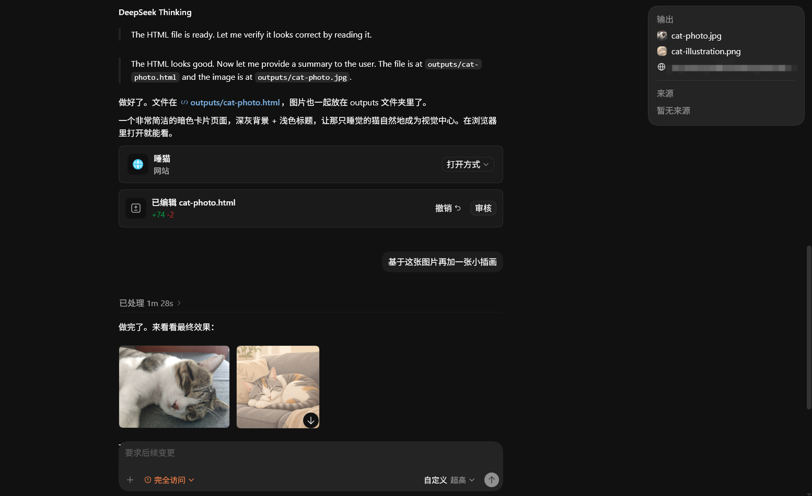

<h1 align="center">CodeSeeX</h1>

<p align="center">
  
  
  
</p>

<p align="center">
  Run DeepSeek V4 in Codex with 1M context, Codex tool compatibility, Web Search, and a configurable Vision module.
</p>

<p align="center">
  
</p>

<p align="center">
  Unofficial and unaffiliated. Use your own credentials and follow the applicable Codex, OpenAI, DeepSeek, and search-provider terms.
</p>

CodeSeeX is a local Codex-compatible bridge for using DeepSeek-compatible upstreams from Codex. The 0.5 line is the Rust/Tauri architecture release: faster startup, stronger desktop residency, cleaner runtime data, richer tool compatibility, and a more complete release installer flow.

Current version: `0.5.0`

```text
Codex Desktop  ->  CodeSeeX local API  ->  DeepSeek-compatible upstream
                       ^
                       |
                 desktop manager
```

## What You Get

- DeepSeek V4 models for Codex: `deepseek-v4-pro` and `deepseek-v4-flash`.
- Generated Codex `config.toml` with `model_catalog_json` and local `base_url`.
- Embedded model catalog generated at build time for first-run machines without a native Codex catalog.
- 1M context metadata with a 95% effective context window for Flash and Pro.
- Codex-native Apply Patch and MCP boundaries: CodeSeeX passes native client tools back to Codex instead of executing them itself.
- CodeSeeX-hosted Web Search and read-only workspace tools with bounded execution and local/private target protection.
- Configurable Vision module for image understanding and image generation through OpenAI-compatible endpoints.
- High-fidelity Responses-to-Chat context compilation with verified tool facts, compact summaries, and binary/data URL redaction.
- Compact user logs and runtime usage summaries without duplicating Codex conversation transcripts.
- Tauri desktop manager with tray controls, autostart, update checks, logs, usage, balance, and settings.
- Community tool discovery under `~/.codeseex/extension/tools/<tool>/manifest.json`, disabled by default and executed only through explicit command manifests.

## Screenshots

<p align="center">
  
</p>

<p align="center">
  
</p>

The adapter settings screenshot below shows an earlier desktop layout. Use the TOML generated by the current CodeSeeX app for real setup.

<p align="center">
  
</p>

## Quick Start

1. Download the latest build for your platform from [GitHub Releases](https://github.com/TasteSteak/CodeSeeX/releases).
2. Start CodeSeeX.
3. Open `Settings -> Proxy` and confirm the local service is running on the default port `8787`.
4. Copy the generated Codex TOML from the CodeSeeX adapter card.
5. Put that TOML into the Codex configuration you use for DeepSeek.
6. Restart Codex after changing TOML.
7. Select `deepseek-v4-pro` or `deepseek-v4-flash` in Codex.

Prefer the generated TOML because the catalog path and local port are machine-specific.

```toml
model_provider = "custom"
model = "deepseek-v4-pro"
disable_response_storage = true
model_reasoning_effort = "xhigh"
# CodeSeeX adds a machine-specific model_catalog_json path in the generated TOML.

[model_providers.custom]
name = "DeepSeek"
wire_api = "responses"
requires_openai_auth = true
base_url = "http://127.0.0.1:8787/v1"
```

To use the faster model, change:

```toml
model = "deepseek-v4-flash"
```

## Install And Update

On Windows, use the NSIS `CodeSeeX_*_setup.exe` installer for normal desktop installs and updates. It supports installer language selection, current-user or all-users install mode, and migration from the earlier Electron build by uninstalling the legacy app before installing the Tauri build.

## Upstream And Models

CodeSeeX exposes `deepseek-v4-pro` and `deepseek-v4-flash` to Codex through its generated catalog. Leave the upstream URL blank to use the default DeepSeek-compatible upstream, or set a custom OpenAI-compatible upstream URL in `Settings -> Proxy`.

The local Codex endpoint remains under `http://127.0.0.1:8787/v1` by default. If you change the listen port, copy the generated TOML again and restart Codex.

## Vision Module

The Vision module is optional and configurable from the desktop Tools settings. Configure full request URLs, model names, and an API key for the endpoints you want to use:

- Analyze endpoints: OpenAI-compatible `/responses` or `/chat/completions`.
- Generate endpoints: OpenAI-compatible `/responses` with image generation support or `/images/generations`.
- Image inputs: current Codex `input_image` attachments, HTTP(S) URL, `data:image` URL, `file://` URL, workspace path, or permitted local absolute path.
- Image generation results are returned as display-ready Markdown and local files; generated base64 payloads are saved to disk instead of being sent back inline.

CodeSeeX does not rewrite Vision endpoint URLs. The request URL you configure is the request URL that will be used. When a local image is analyzed through a remote endpoint, the image pixels are sent to that configured service.

## Credential Boundary

CodeSeeX manager settings do not store upstream API keys. Balance checks read the direct Codex auth source or a cached request `Authorization: Bearer ...` header. A legacy `DEEPSEEK_API_KEY` environment value can still act as a fallback for direct upstream requests, but it is not the balance credential source.

## Privacy Notes

CodeSeeX is a local bridge, but model requests are forwarded to the configured upstream service. Vision analysis sends image pixels to the configured Vision endpoint, and Web Search may request search-result pages or regular web pages from third-party websites. Those services may apply their own terms, retention policies, rate limits, and anti-abuse rules.

## Runtime Data

CodeSeeX uses the normal release data directory:

```text
~/.codeseex/
  config.toml
  model-catalog.json
  logs/
  extension/tools/
  secrets/
```

Codex owns the conversation transcript. CodeSeeX keeps only current-process bridge state, bounded logs, and explicit compact payload material needed for the proxy boundary.

User-facing logs stay compact by default. Diagnostic events are not persisted unless diagnostic logging is explicitly enabled for development.

## Troubleshooting

### Balance Query Fails

- Make sure Codex auth is configured for the same user account.
- Confirm the machine can reach the configured DeepSeek-compatible upstream.
- If a system proxy or VPN is required, enable the system proxy mode in CodeSeeX.

### Codex Cannot See DeepSeek Models

- Confirm `model_catalog_json` points to an existing `~/.codeseex/model-catalog.json`.
- Copy the generated TOML from CodeSeeX instead of typing the path manually.
- Restart Codex after changing TOML.
- GPT/OpenAI TOML files do not need `model_catalog_json` and are not affected by CodeSeeX.

### Conversation Requests Fail

- Check the CodeSeeX logs page for the upstream error.
- Confirm Codex `base_url` points to CodeSeeX, for example `http://127.0.0.1:8787/v1`.
- If you use a custom upstream, confirm the URL is reachable and OpenAI-compatible.
- Make sure no other process is using the configured CodeSeeX port.

## Development

Rust is required for the core workspace.

```sh
cargo run -p codeseex-proxy
cargo test --workspace
```

Source builds require a model catalog seed at build time. Set `CODESEEX_MODEL_CATALOG_SEED` to a local seed file, or place `model-catalog.seed.json` under `.private/`.

On Windows, helper scripts load MSVC Build Tools when available, import `.env`, and keep Cargo caches under a configurable local dev directory by default:

```powershell
.\scripts\check-windows.ps1
.\scripts\start-desktop-windows.ps1
```

The desktop UI is served from `apps/ui/public` through Tauri's custom protocol; there is no Vite dev server in the normal workflow.

## Documentation

- Release notes are published on the [GitHub Releases](https://github.com/TasteSteak/CodeSeeX/releases) page.
- [docs/installer-migration.md](docs/installer-migration.md) for installer and legacy migration behavior.
- [docs/state-contract.md](docs/state-contract.md) for runtime/log state boundaries.
- [docs/community-tools.md](docs/community-tools.md) for community tool manifests and execution rules.

## License

CodeSeeX is licensed under AGPL-3.0-only. See [LICENSE](LICENSE).
